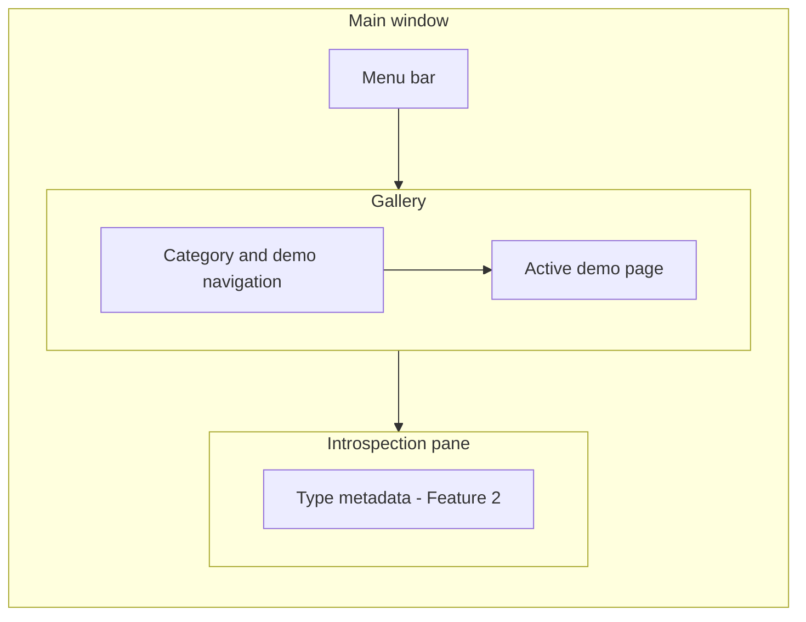

# Feature 3 Widget Gallery

## Copyright

(c) Copyright 2026 onwards Warwick Molloy.
Contribution to this project is supported and contributors will be recognised.

# Status

Complete — 2026-07-29.

Defines navigable widget demos aligned with the upstream
[GTK4 Widget Gallery](https://docs.gtk.org/gtk4/visual_index.html). Implementation
delivers the gallery framework and initial demo set on branch `wm/feature-3`.

Builds on the Feature 1 shell and Feature 2 introspection pane. Adds a structured
gallery as default content. The user switches to the Feature 2 sample palette or
back to the gallery from the View menu.

# Overview

Feature 3 turns the GTK Widget Demo into a runnable companion to the
[GTK4 visual index](https://docs.gtk.org/gtk4/visual_index.html). A developer
browses gallery categories and individual widget examples in the main window,
runs each demo interactively, and uses the existing **View → Inspect widget**
workflow to explore GObject metadata on gallery widgets.

The feature introduces a `gallery` code group per
[c-code-standard.md](../c-code-standard.md), a navigation shell that mirrors the
five visual-index sections, and a registry pattern so new demos can be added as
small units without reworking the window layout. Delivery is phased: framework
plus an initial demo set in Feature 3; the rest of the visual index follows in
later work — see
[2026-07-26-plan-feature-3-framework-first-catalog-later.md](../notes/2026-07-26-plan-feature-3-framework-first-catalog-later.md).

Feature 3 does not add live property editing, custom GObject type tutorials, or
per-demo curated “type facts” panels (plan Phase C in
[2026-07-22-plan-gobject-type-exploration.md](../notes/2026-07-22-plan-gobject-type-exploration.md)).

# Use cases

1. A developer runs `./build/gtk-widget-demo`, selects a category in the gallery
   sidebar (for example **Buttons**), chooses a demo entry (for example
   **GtkSwitch**), and sees a focused runnable example of that widget in the main
   content area.

2. A developer reads the demo heading (and optional short description) on a
   gallery page, follows a link to the matching upstream GTK doc page, and
   compares the in-app example with the official reference.

3. A developer enables **View → Inspect widget**, clicks a control inside the
   active gallery demo, and sees type ancestry, properties, and signals in the
   existing introspection pane — without gallery-specific introspection code.

4. A contributor adds a new widget demo by registering it under the correct
   visual-index category in the `gallery` group, following the demo page pattern,
   without editing `src/main.c` or the introspection units.

5. A developer switches **View → Sample palette** to see the Feature 2 compact
   control grid, or **View → Widget gallery** to browse visual-index demos.

# Application UI

Feature 3 makes the widget **gallery** the default main content while keeping
the Feature 1 menu bar and Feature 2 horizontal split (main area + introspection
pane). The user switches between gallery and sample via **View → Widget gallery**
and **View → Sample palette** (radio group; gallery selected on startup).

## Shell

| Element         | Detail |
| --------------- | --- |
| File menu       | **File → Exit** unchanged from Feature 1 |
| View menu       | **View → Inspect widget** unchanged from Feature 2 |
| View menu       | **View → Widget gallery** and **View → Sample palette** (radio group; gallery default) |
| Escape          | Exits pick mode (Feature 2 behaviour preserved) |
| Layout          | Menu bar; gallery or sample palette in main content; introspection pane |
| Default content | Widget gallery on startup |
| Title           | Static **GTK Widget Demo** (see [delivery decisions](#delivery-decisions)) |

The introspection pick root continues to cover the menu bar and gallery content
(the same region as today’s `root_box` in `window-shell.c`).

## Gallery navigation

Navigation follows the five sections of the upstream visual index:

1. Display widgets

2. Buttons

3. Entries

4. Containers

5. Windows

| UI element        | Detail |
| ----------------- | --- |
| Category list     | Sidebar or equivalent; section headings match visual-index names |
| Demo list         | Entries under each category; label is the GType name (for example `GtkLabel`) |
| Content area      | Shows the active demo page when a demo is selected |
| Default selection | Sensible first demo on startup (for example first **Display widgets** entry) |
| Empty state       | Avoided on first run — at least one demo per category in the initial set |

Recommended implementation: `GtkStack` for demo pages plus a sidebar built from
`GtkListBox`, `GtkColumnView`, or a nested list — exact widgets are an
implementation choice as long as the five categories and demo names are clear.



## Demo page pattern

Each gallery demo is a self-contained page in the content area:

| Field         | Detail |
| ------------- | --- |
| Title         | Widget name (for example **GtkScale**) |
| Description   | One or two sentences on what the demo shows (optional but encouraged) |
| Upstream link | URL to the matching [docs.gtk.org](https://docs.gtk.org/gtk4/visual_index.html) class page |
| Widget area   | Runnable example(s); may include labels showing key properties or signals |
| Scope         | One primary widget per page in Feature 3; supporting chrome only — see [demo page scope note](../notes/2026-07-26-plan-feature-3-one-widget-per-demo-page.md) |

Demos are read-only teaching examples unless interaction is inherent to the
widget (for example clicking a button, toggling a switch). Demos must not
require network access.

### Windows category

Top-level window and dialog types are demonstrated via **modal launch** from the
demo page (**Show …** button). Details in
[2026-07-26-plan-feature-3-modal-dialogs-window-types.md](../notes/2026-07-26-plan-feature-3-modal-dialogs-window-types.md).

# Initial demo set

Feature 3 delivers a **navigable gallery framework** plus the demos below.
The gallery is the default main content. The Feature 2 sample palette stays
available when the user chooses **View → Sample palette** (see design decision 3).

The initial set gives at least one runnable example per visual-index category
and mirrors the teaching value of the sample palette widgets as individual demos.

## Display widgets

| Demo             | Notes |
| ---------------- | --- |
| `GtkLabel`       | Text and alignment; replaces sample-palette label |
| `GtkSpinner`     | Indeterminate activity indicator |
| `GtkProgressBar` | Fraction and pulse modes |
| `GtkScale`       | Horizontal range; replaces sample-palette scale |

## Buttons

| Demo              | Notes |
| ----------------- | --- |
| `GtkButton`       | Click handler with visible feedback |
| `GtkCheckButton`  | Boolean state; replaces sample-palette check |
| `GtkSwitch`       | Active state; replaces sample-palette switch |
| `GtkToggleButton` | Toggled state distinct from check button |

## Entries

| Demo            | Notes |
| --------------- | --- |
| `GtkEntry`      | Editable text; replaces sample-palette entry |
| `GtkSpinButton` | Numeric entry with adjustment |

## Containers

| Demo          | Notes |
| ------------- | --- |
| `GtkBox`      | Horizontal box with nested children; replaces sample-palette nested box |
| `GtkGrid`     | Row and column placement |
| `GtkFrame`    | Labelled container |
| `GtkNotebook` | Multiple pages; exercises tabbed layout |

## Windows

| Demo               | Notes |
| ------------------ | --- |
| `GtkAboutDialog`   | Opened from a button on the demo page |
| `GtkMessageDialog` | Information or question dialog opened from a button |

Total: **14** initial demos across **5** categories.

Remaining visual-index widgets are listed in
[2026-07-26-plan-feature-3-framework-first-catalog-later.md](../notes/2026-07-26-plan-feature-3-framework-first-catalog-later.md).

# Acceptance criteria

1. On a Linux system with GTK4 development libraries installed, `meson setup build`
   followed by `meson compile -C build` completes without errors, including new
   `gallery` sources.

2. Running the built executable opens the Feature 1 window with Feature 2
   introspection unchanged: **View → Inspect widget**, Escape, and the side
   pane behave as before.

3. The main content area shows gallery navigation with the five visual-index
   categories and demo entries under each category.

4. Selecting a demo updates the content area to that demo’s page without
   restarting the application.

5. Each demo in the [initial demo set](#initial-demo-set) is present, runnable,
   and shows the primary widget type described in its table row.

6. Each demo page includes a link (label, button, or markup) to the matching
   upstream GTK class documentation.

7. **View → Widget gallery** and **View → Sample palette** switch the main content
   area between the gallery shell and the Feature 2 sample palette. **Widget gallery**
   is selected on startup. Only one mode is visible at a time.

8. Pick mode can target widgets inside the active gallery demo or the sample
   palette and update the introspection pane with correct metadata.

9. Modal window demos (**GtkAboutDialog**, **GtkMessageDialog**) open and close
   without leaving zombie dialogs or crashing when the main window is closed.

10. [README.md](../../README.md) documents gallery navigation, switching between
    **View → Widget gallery** and **View → Sample palette**, and points to the
    upstream visual index.

11. New source and header files follow [c-code-standard.md](../c-code-standard.md)
    and carry the project copyright notice.

12. Tests under `test/gallery/` pass via `meson test -C build` (see
    [Tests](#tests)).

# Technical acceptance criteria

## Build system

| Requirement     | Detail |
| --------------- | --- |
| Root build file | Extend `meson.build` to compile `gallery` group sources |
| GTK dependency  | Continue using `dependency('gtk4', include_type: 'system')` |
| Warnings        | `warning_level=3` on project code |
| Executable      | Still one target (`gtk-widget-demo`); link gallery objects |
| Tests           | Meson test target(s) for `test/gallery/` |

Expected contributor workflow on Linux:

```bash
meson setup build
meson compile -C build
meson test -C build
./build/gtk-widget-demo
```

## Code layout

The `gallery` group follows [c-code-standard.md](../c-code-standard.md). Suggested
units (names may adjust during implementation):

| Path                                | Role |
| ----------------------------------- | --- |
| `include/gallery.h`                 | Group umbrella header |
| `include/gallery/gallery-shell.h`   | Navigation UI and stack of demo pages |
| `include/gallery/demo-registry.h`   | Categories, demo metadata, registration API |
| `include/gallery/demo-page.h`       | Shared demo page chrome (title, link, content slot) |
| `include/gallery/display-demos.h`   | Display category demo builders |
| `include/gallery/button-demos.h`    | Buttons category demo builders |
| `include/gallery/entry-demos.h`     | Entries category demo builders |
| `include/gallery/container-demos.h` | Containers category demo builders |
| `include/gallery/window-demos.h`    | Windows category demo builders |
| `src/gallery/gallery-shell.c`       | Implementation |
| `src/gallery/demo-registry.c`       | Implementation |
| `src/gallery/demo-page.c`           | Implementation |
| `src/gallery/display-demos.c`       | Implementation |
| `src/gallery/button-demos.c`        | Implementation |
| `src/gallery/entry-demos.c`         | Implementation |
| `src/gallery/container-demos.c`     | Implementation |
| `src/gallery/window-demos.c`        | Implementation |

`src/main/window-shell.c` embeds the gallery shell by default and switches content
when the user selects **View → Widget gallery** or **View → Sample palette**.
Entry point `src/main.c` stays thin.

When a category unit grows large, split demo builders into sub-units under
`src/gallery/<category>/` per the subgroup rules in
[c-code-standard.md](../c-code-standard.md).

### Demo registration API

The registry should expose a stable pattern for contributors, for example:

- register a category id and display title matching the visual index;

- register a demo with id, title, upstream doc URL, and a callback that returns
  the demo page widget or populates a content slot;

- lookup demos for populating navigation and switching the `GtkStack`.

Exact function names are an implementation detail; the feature is satisfied when
adding a demo does not require editing unrelated units beyond its category file
and one registry entry.

## Application behaviour

| Requirement   | Detail |
| ------------- | --- |
| Shell         | Preserve Feature 1 quit and Feature 2 inspect actions |
| Content       | **View → Widget gallery** (default) or **View → Sample palette** |
| Navigation    | Five categories; demo list; single active demo page |
| Introspection | Feature 2 pane and **View → Inspect widget** unchanged; see [reuse introspection note](../notes/2026-07-26-plan-feature-3-reuse-introspection.md) |
| Demo lifetime | Destroy or hide previous demo widgets when switching demos; no leaked dialogs |
| Accessibility | Demo pages use sensible default labels where GTK provides them |

## Documentation

| Requirement | Detail |
| ----------- | --- |
| README      | **View → Widget gallery** / **Sample palette**; link to visual index |
| README      | Note that introspection (Feature 2) applies to gallery widgets |
| Feature doc | Update [AGENTS.md](../../AGENTS.md) current-state table when Feature 3 ships |
| Copyright   | New source files carry the project copyright notice |

## Tests

Gallery UI is primarily exercised manually. Automated tests should focus on
logic that is stable without driving the full window:

| Requirement   | Detail |
| ------------- | --- |
| Location      | `test/gallery/` mirroring group name |
| Registry      | Assert expected category count (5) and demo counts per category for the initial set |
| Demo builders | Each category test invokes demo builder callbacks and asserts non-NULL root widget |
| Version drift | Avoid brittle property-value assertions; smoke-test widget types where practical |
| Runner        | Invoked via `meson test -C build` |

# Design decisions

1. **Visual index as source of truth:** resolved — gallery taxonomy (categories,
   demo titles, doc links, in-category order) follows the upstream visual index;
   see [2026-07-26-plan-feature-3-visual-index-source-of-truth.md](../notes/2026-07-26-plan-feature-3-visual-index-source-of-truth.md).

2. **Framework first, full catalog later:** resolved — Feature 3 ships gallery
   infrastructure plus the [initial demo set](#initial-demo-set); follow-on
   widgets are incremental; see
   [2026-07-26-plan-feature-3-framework-first-catalog-later.md](../notes/2026-07-26-plan-feature-3-framework-first-catalog-later.md).

3. **Sample palette as menu choice:** resolved — user switches between
   **View → Widget gallery** (default) and **View → Sample palette**; see
   [2026-07-26-plan-feature-3-sample-palette-menu-choice.md](../notes/2026-07-26-plan-feature-3-sample-palette-menu-choice.md).

4. **Reuse introspection:** resolved — Feature 2 introspection pane and
   algorithms unchanged; **View → Inspect widget** is the sole in-app type view;
   see
   [2026-07-26-plan-feature-3-reuse-introspection.md](../notes/2026-07-26-plan-feature-3-reuse-introspection.md).

5. **One primary widget per demo page:** resolved — Feature 3 starts with one
   primary widget per page (Option A); multi-widget pages may follow later; see
   [2026-07-26-plan-feature-3-one-widget-per-demo-page.md](../notes/2026-07-26-plan-feature-3-one-widget-per-demo-page.md).

6. **Modal dialogs for window types:** resolved — Windows-category demos launch
   dialogs modally from the demo page; see
   [2026-07-26-plan-feature-3-modal-dialogs-window-types.md](../notes/2026-07-26-plan-feature-3-modal-dialogs-window-types.md).

# Out of scope

The following belong in later features, not Feature 3:

1. Every visual-index widget not in the [initial demo set](#initial-demo-set)
   (follow-on catalog in
   [2026-07-26-plan-feature-3-framework-first-catalog-later.md](../notes/2026-07-26-plan-feature-3-framework-first-catalog-later.md)).

2. Per-demo curated “type facts” panels (plan Phase C).

3. Live property editing via `g_object_set()` from the introspection UI.

4. Signal emission logging or temporary debug handlers on gallery widgets.

5. Custom GObject type definitions (`G_DEFINE_FINAL_TYPE`, tutorial types).

6. Search across demos, favourites, or recents (may come later).

7. Theming/CSS editor, widget tree browser, or other GTK Inspector capabilities.

8. Cross-platform CI or Windows/macOS verification (manual Linux success is
   enough for this milestone).

9. Packaging, installation targets, or desktop integration beyond a bare
   executable.

# Risks

1. **Scope creep:** resist implementing the entire visual index in Feature 3;
   use the registry so remaining widgets land incrementally.

2. **Navigation complexity:** start with a simple sidebar + stack; defer advanced
   patterns (search, icons per widget) until the initial set is stable.

3. **Dialog demos:** modal windows must be parented to the main window and
   destroyed on shutdown; test closing the app while a dialog is open.

4. **Pick mode vs demo interaction:** gallery demos that use buttons must still
   work in pick mode (Feature 2 claimed-click behaviour); verify toggles and
   dialog launch buttons do not fight inspection.

5. **GTK version drift:** prefer smoke tests and type names over fixed property
   inventories; document GTK4-only APIs (for example `gtk_editable_set_text`).

6. **Large category units:** when a category file grows hard to reason about,
   split demo builders into sub-units under `src/gallery/<category>/` using
   responsibility boundaries per [c-code-standard.md](../c-code-standard.md).

# Delivery decisions

Two items were open before implementation; both were resolved at delivery
(2026-07-29). Options and rationale are in
[2026-07-26-todo-feature-3-open-decisions.md](../notes/2026-07-26-todo-feature-3-open-decisions.md).
Implementation details are in
[2026-07-29-coding-feature-3-widget-gallery.md](../notes/2026-07-29-coding-feature-3-widget-gallery.md).

| #   | Topic          | Resolution |
| --- | -------------- | --- |
| 1   | Window title   | Static **GTK Widget Demo** (`window-shell.c`) |
| 2   | Sidebar widget | `GtkListBox` with unselectable category header rows (`gallery-shell.c`) |

Optional follow-on refinements (dynamic title, tree sidebar) are not blockers
for Feature 3 acceptance.

# References

[README.md](../../README.md)

[c-code-standard.md](../c-code-standard.md)

[feature-1-base-application.md](./feature-1-base-application.md)

[feature-2-gobject-introspection.md](./feature-2-gobject-introspection.md)

[2026-07-22-plan-gobject-type-exploration.md](../notes/2026-07-22-plan-gobject-type-exploration.md)

[2026-07-26-plan-feature-3-visual-index-source-of-truth.md](../notes/2026-07-26-plan-feature-3-visual-index-source-of-truth.md)

[2026-07-26-plan-feature-3-framework-first-catalog-later.md](../notes/2026-07-26-plan-feature-3-framework-first-catalog-later.md)

[2026-07-26-plan-feature-3-sample-palette-menu-choice.md](../notes/2026-07-26-plan-feature-3-sample-palette-menu-choice.md)

[2026-07-26-plan-feature-3-reuse-introspection.md](../notes/2026-07-26-plan-feature-3-reuse-introspection.md)

[2026-07-26-plan-feature-3-one-widget-per-demo-page.md](../notes/2026-07-26-plan-feature-3-one-widget-per-demo-page.md)

[2026-07-26-plan-feature-3-modal-dialogs-window-types.md](../notes/2026-07-26-plan-feature-3-modal-dialogs-window-types.md)

[2026-07-26-todo-feature-3-open-decisions.md](../notes/2026-07-26-todo-feature-3-open-decisions.md)

[2026-07-29-coding-feature-3-widget-gallery.md](../notes/2026-07-29-coding-feature-3-widget-gallery.md)

[2026-07-29-plan-pick-mode-escape-idle-uaf.md](../notes/2026-07-29-plan-pick-mode-escape-idle-uaf.md)

[2026-07-30-plan-widget-align-natural-size.md](../notes/2026-07-30-plan-widget-align-natural-size.md)

[GTK4 Widget Gallery — visual index](https://docs.gtk.org/gtk4/visual_index.html)

[GTK4 Documentation index](https://docs.gtk.org/gtk4/index.html)
