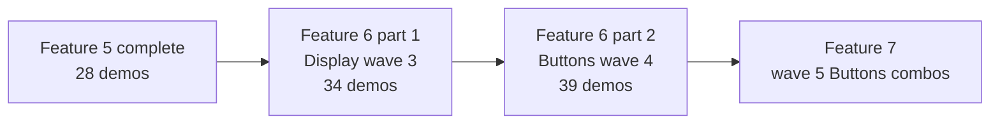

# Feature 6 Widget Gallery Catalog Waves 3 and 4

## Copyright

(c) Copyright 2026 onwards Warwick Molloy.
Contribution to this project is supported and contributors will be recognised.

# Status

**Planned** — two-part catalog feature on branch `wm/feature-6`, building on
Feature 5 (`main` at **28** demos):

1. **Part 1 — Catalog wave 3** (Display remainder): **Planned** — **6** new demos;
   completes the Display category (**21** demos); **34** total.

2. **Part 2 — Catalog wave 4** (Buttons links, menus, toggles): **Planned** — **5**
   new demos; Buttons category grows to **9**; **39** total.

Wave sizing and sequencing follow
[2026-08-05-plan-widget-gallery-catalog-nine-waves.md](../notes/2026-08-05-plan-widget-gallery-catalog-nine-waves.md).
This feature combines catalog **waves 3 and 4** into one numbered feature; later
features shift by one (catalog wave 5 maps to Feature 7, and so on) — see
[Relationship to nine-waves numbering](#relationship-to-nine-waves-numbering).

# Overview

Feature 5 delivered **28** demos, including the Display risk spike (**GtkGLArea**,
**GtkVideo**, **GtkPopoverMenu**) registered after **GtkScale** before the
remaining Display entries. Feature 6 **part 1** finishes the Display category:
six demos that reuse wave 2 patterns where applicable (media after **GtkVideo**,
popover menu bar after **GtkPopoverMenu**) and restore **full visual-index order**
within Display — including moving **GtkPopoverMenu** to its upstream position
after **GtkEmojiChooser**.

Feature 6 **part 2** begins the Buttons catalog expansion: five interactive
button-family widgets without list models or dialog-button machinery (deferred
to catalog wave 5 / Feature 7). Existing Feature 3 button demos are reordered to
visual-index order when part 2 lands.

Taxonomy, naming, ordering, and doc links continue to follow
[2026-07-26-plan-feature-3-visual-index-source-of-truth.md](../notes/2026-07-26-plan-feature-3-visual-index-source-of-truth.md).

Feature 6 does not implement combo boxes, dialog buttons, or **GtkDropDown**
(Feature 7 / catalog wave 5), migration comparison **content**
(`build_comparison` builders), phase 3 hide-deprecated toggle, or gallery search,
favourites, or live property editing.

# Use cases

## Part 1 — Catalog wave 3 (Display remainder)

1. A developer opens **Display widgets** and finds **GtkDrawingArea**,
   **GtkMediaControls**, **GtkWindowControls**, **GtkPopoverMenuBar**,
   **GtkCalendar**, and **GtkEmojiChooser** at their visual-index positions among
   the Feature 3–5 entries.

2. A developer sees **GtkPopoverMenu** at the end of the Display list (after
   **GtkEmojiChooser**), matching the upstream visual index.

3. A developer runs **GtkDrawingArea** and sees a simple draw callback (for example
   a filled shape or stroke) inside the demo page.

4. A developer runs **GtkMediaControls** paired with the bundled sample video (same
   asset and graceful-degradation approach as **GtkVideo**).

5. A developer runs **GtkPopoverMenuBar**, opens popover menus from the menu bar,
   and dismisses them — extending the wave 2 **GtkPopoverMenu** pattern.

6. A developer selects a date on **GtkCalendar** and reads feedback showing the
   chosen date.

7. A developer picks an emoji in **GtkEmojiChooser** and sees selection feedback.

8. A contributor registers each wave 3 demo under `src/gallery/display-demos/`,
   updates `display_demos[]` in visual-index order, sets `GALLERY_DEMO_SUPPORTED`,
   and extends gallery smoke tests — without editing `gallery-shell.c` navigation
   logic.

## Part 2 — Catalog wave 4 (Buttons)

1. A developer opens **Buttons** and finds **GtkLinkButton**,
   **GtkRadioButton**, **GtkMenuButton**, **GtkLockButton**, and
   **GtkVolumeButton** at their visual-index positions.

2. Existing button demos (**GtkButton**, **GtkToggleButton**, **GtkCheckButton**,
   **GtkSwitch**) appear in visual-index order relative to the new entries.

3. Each new demo shows visible state or action feedback (link URI, radio group
   selection, menu open, lock state, volume level) following Feature 3 button
   conventions.

4. A contributor adds each wave 4 demo as a sub-unit under
   `src/gallery/button-demos/`, registers it in `button_demos[]` at the correct
   visual-index position, sets `GALLERY_DEMO_SUPPORTED`, and updates gallery smoke
   tests.

# Relationship to Feature 5

| Aspect               | Feature 5 (complete)              | Feature 6 part 1 (wave 3)      | Feature 6 part 2 (wave 4) |
| -------------------- | --------------------------------- | ------------------------------ | --- |
| Gallery shell        | Deprecated subsections            | Unchanged                      | Unchanged |
| Demo count           | **28**                            | **34** (+6)                    | **39** (+5) |
| Display demos        | **15**                            | **21** (category **complete**) | Unchanged |
| Buttons demos        | **4**                             | **4** (unchanged)              | **9** (+5) |
| Registry API         | Lifecycle + comparison hooks      | Unchanged                      | Unchanged |
| Display order        | Wave 2 entries after **GtkScale** | Full visual-index order        | Unchanged |
| Buttons order        | Feature 3 subset order            | Unchanged                      | Visual-index order |
| New deprecated demos | None in wave 2                    | None expected                  | None expected |
| Code layout          | `display-demos/` sub-units        | Six new display sub-units      | `button-demos/` sub-units |

Post–Feature 5 behaviour (deprecated UX, **GtkVideo** fallback panel, bundled
`demo-short.mp4`, `libepoxy` for **GtkGLArea**) remains in place.

# Relationship to nine-waves numbering

The nine-waves note originally mapped one catalog wave per feature from Feature 4
onward. Feature 5 combined deprecation infrastructure with catalog wave 2.
Feature 6 combines catalog **waves 3 and 4**:

| Catalog wave | Original feature (nine-waves note) | Delivered in |
| ------------ | ---------------------------------- | --- |
| 3            | Feature 6                          | Feature 6 **part 1** |
| 4            | Feature 7                          | Feature 6 **part 2** |
| 5            | Feature 8                          | Feature 7 (planned) |
| 6–9          | Features 9–12                      | Features 8–11 (planned) |

Update the nine-waves note when Feature 6 is accepted; this spec is authoritative
for Feature 6 scope.

# Recommended delivery order



Deliver **part 1 before part 2** so the Display category completes and
**GtkPopoverMenu** moves to its final slot before Buttons work begins. Part 2
may land in the same PR or an immediate follow-up on `wm/feature-6`.

# Part 1 — Catalog wave 3 (Display remainder)

Six demos finish the Display category using patterns from Feature 5 where noted.
Implement demos in any convenient order; register each at its upstream
visual-index slot in `display_demos[]`.

## Registry reorder (part 1)

Feature 5 registered **GtkGLArea**, **GtkVideo**, and **GtkPopoverMenu**
consecutively after **GtkScale**. Part 1 **inserts** the six new entries and
**moves** **GtkPopoverMenu** to after **GtkEmojiChooser** so the Display list
matches the
[GTK4 visual index — Display widgets](https://docs.gtk.org/gtk4/visual_index.html).

Full Display registry order after Feature 6 part 1 (existing entries in **bold**;
new entries marked *wave 3*; *moved* marks reorder of a wave 2 demo):

| Order | Demo                 | Notes |
| ----- | -------------------- | --- |
| 1     | **GtkLabel**         | Feature 3 |
| 2     | **GtkSpinner**       | Feature 3 |
| 3     | **GtkStatusbar**     | Feature 4; deprecated |
| 4     | **GtkLevelBar**      | Feature 4 |
| 5     | **GtkProgressBar**   | Feature 3 |
| 6     | **GtkInfoBar**       | Feature 4; deprecated |
| 7     | **GtkScrollbar**     | Feature 4 |
| 8     | **GtkImage**         | Feature 4 |
| 9     | **GtkPicture**       | Feature 4 |
| 10    | **GtkSeparator**     | Feature 4 |
| 11    | **GtkTextView**      | Feature 4 |
| 12    | **GtkScale**         | Feature 3 |
| 13    | **GtkGLArea**        | Feature 5 |
| 14    | GtkDrawingArea       | *wave 3* — simple `snapshot` or draw callback |
| 15    | **GtkVideo**         | Feature 5 |
| 16    | GtkMediaControls     | *wave 3* — bound to same bundled video as **GtkVideo** |
| 17    | GtkWindowControls    | *wave 3* — minimal header-bar or titlebar context |
| 18    | GtkPopoverMenuBar    | *wave 3* — popover menus; builds on wave 2 pattern |
| 19    | GtkCalendar          | *wave 3* — date selection with label feedback |
| 20    | GtkEmojiChooser      | *wave 3* — emoji pick with selection feedback |
| 21    | **GtkPopoverMenu**   | Feature 5; *moved* to visual-index position |

Category count after part 1: Display **21**. Cumulative total **34**.

## Part 1 demo notes

| Demo              | Primary widget    | Implementation hints |
| ----------------- | ----------------- | --- |
| GtkDrawingArea    | GtkDrawingArea    | `set_draw_func` or `snapshot` handler drawing a simple shape; fixed size request |
| GtkMediaControls  | GtkMediaControls  | `gtk_media_controls_new()` wired to `GtkMediaFile` / filename for `demo-short.mp4`; reuse video fallback/error pattern where playback fails |
| GtkWindowControls | GtkWindowControls | Embed in a shallow `GtkHeaderBar` or box mimicking titlebar chrome; document inspect target in description |
| GtkPopoverMenuBar | GtkPopoverMenuBar | `GMenu` model; one or two menus; dismiss on Escape and click-outside |
| GtkCalendar       | GtkCalendar       | Connect `day-selected`; show ISO date in a label |
| GtkEmojiChooser   | GtkEmojiChooser   | Connect `emoji-picked` or read selection; show chosen emoji in a label |

All six register as `GALLERY_DEMO_SUPPORTED`.

## Part 1 acceptance criteria

1. `meson compile -C build` and `meson test -C build` pass on Linux with GTK4 dev
   packages.

2. Feature 1–5 behaviour is preserved (menus, gallery, introspection, deprecation
   UX, wave 2 Display demos).

3. Display sidebar lists **21** demos in the [registry order](#registry-reorder-part-1)
   above, including **Deprecated** subsection unchanged.

4. **GtkPopoverMenu** appears after **GtkEmojiChooser**, not before **GtkDrawingArea**.

5. Each wave 3 demo page is runnable with the primary widget described in its row.

6. Each wave 3 demo page links to the matching upstream GTK class documentation.

7. Pick mode can target the primary widget on each wave 3 page (document composite
   cases such as **GtkWindowControls** in header chrome if the bare control is not
   the main inspect target).

8. Interactive controls remain usable alongside pick mode where applicable.

9. Registry tests assert Display **21**, total **34**, and display demo id order.

10. New sources follow [c-code-standard.md](../c-code-standard.md) and use
    `include/gtk-version.h`.

11. **GtkMediaControls** does not require network access; reuse bundled
    `data/demo-short.mp4` with the same runtime prerequisites documented for
    **GtkVideo**.

12. Media or popover failures show inline fallback text rather than crashing the
    application (graceful degradation, same standard as Feature 5).

# Part 2 — Catalog wave 4 (Buttons)

Five demos extend the Buttons category. No `GtkStringList`, combo boxes, or
dialog-button APIs (catalog wave 5 / Feature 7).

## Registry reorder (part 2)

Feature 3 shipped four button demos out of strict visual-index order. Part 2
**inserts** five new entries and **reorders** the four existing demos to match the
[GTK4 visual index — Buttons](https://docs.gtk.org/gtk4/visual_index.html).

Full Buttons registry order after Feature 6 part 2 (existing entries in **bold**;
new entries marked *wave 4*):

| Order | Demo                | Notes |
| ----- | ------------------- | --- |
| 1     | **GtkButton**       | Feature 3 |
| 2     | **GtkToggleButton** | Feature 3; *moved* before **GtkCheckButton** |
| 3     | GtkLinkButton       | *wave 4* — project or docs.gtk.org URI |
| 4     | **GtkCheckButton**  | Feature 3; *moved* after **GtkToggleButton** |
| 5     | GtkRadioButton      | *wave 4* — mutually exclusive group with feedback label |
| 6     | GtkMenuButton       | *wave 4* — `GMenu` or popover; distinct from Display popover demos |
| 7     | GtkLockButton       | *wave 4* — toggles locked state visibly |
| 8     | GtkVolumeButton     | *wave 4* — volume popover; show level feedback |
| 9     | **GtkSwitch**       | Feature 3; *moved* after volume widgets per visual index |

Follow the visual index for **GtkRadioButton** documentation URL even when upstream
links to **GtkCheckButton** — see
[2026-07-26-plan-feature-3-visual-index-source-of-truth.md](../notes/2026-07-26-plan-feature-3-visual-index-source-of-truth.md).

Category count after part 2: Buttons **9**. Cumulative total **39**.

## Part 2 demo notes

| Demo            | Primary widget  | Implementation hints |
| --------------- | --------------- | --- |
| GtkLinkButton   | GtkLinkButton   | Safe https URI; accessible label |
| GtkRadioButton  | GtkRadioButton  | Two or three radios in one group; label shows active choice |
| GtkMenuButton   | GtkMenuButton   | Simple `GMenu`; menu opens on click |
| GtkLockButton   | GtkLockButton   | Label reflects locked / unlocked |
| GtkVolumeButton | GtkVolumeButton | Connect volume notify; optional muted state label |

All five register as `GALLERY_DEMO_SUPPORTED`.

## Part 2 acceptance criteria

1. `meson compile -C build` and `meson test -C build` pass after part 2 changes.

2. Feature 6 part 1 and Feature 1–5 behaviour remain intact.

3. Buttons sidebar lists **9** demos in the [registry order](#registry-reorder-part-2)
   above.

4. Each wave 4 demo page is runnable with visible feedback for its primary behaviour.

5. Each wave 4 demo page links to the upstream GTK class documentation (visual-index
   URL for **GtkRadioButton**).

6. Pick mode and interactive controls behave as in prior features.

7. Registry tests assert Buttons **9**, total **39**, and button demo id order.

8. New button demos live in `src/gallery/button-demos/` sub-units with headers under
    `include/gallery/button-demos/`; migrate inline builders from `button-demos.c`
    into sub-units when touching the category (same approach as Feature 4 Entries).

# Application UI

No shell changes beyond new sidebar rows and registry reordering within Display and
Buttons.

| Element            | Detail |
| ------------------ | --- |
| File menu          | Unchanged |
| View menu          | Unchanged |
| Gallery navigation | +6 Display rows (part 1); +5 Buttons rows (part 2); Display and Buttons order updated |
| Default selection  | Unchanged (**GtkLabel**) |
| Deprecated UX      | Unchanged |

# Acceptance criteria

## Feature 6 complete

1. Part 1 and part 2 acceptance criteria above are both met.

2. Demo count is **39**; Display **21** (complete); Buttons **9**.

3. Every implemented demo in Display and Buttons categories follows visual-index
   order within that category.

# Technical acceptance criteria

## Build system

| Requirement     | Detail |
| --------------- | --- |
| Root build file | Add display and button sub-units to `meson.build`; no new dependencies expected beyond Feature 5 (`gtk4`, `epoxy`) |
| GTK dependency  | Continue `dependency('gtk4', include_type: 'system')` |
| Bundled assets  | Reuse `data/demo-short.mp4` and `GALLERY_DATA_DIR` for **GtkMediaControls** |
| Tests           | Update `test/gallery/demo-registry.c` counts and category order tests |

Expected workflow:

```bash
meson setup build
meson compile -C build
meson test -C build
./build/gtk-widget-demo
```

## Code layout

### Part 1 — Display wave 3

| Path                                                    | Role |
| ------------------------------------------------------- | --- |
| `src/gallery/display-demos.c`                           | Registry table; insert six entries; reorder **GtkPopoverMenu** |
| `src/gallery/display-demos/gtk-drawing-area-demo.c`     | **GtkDrawingArea** |
| `src/gallery/display-demos/gtk-media-controls-demo.c`   | **GtkMediaControls** + bundled video |
| `src/gallery/display-demos/gtk-window-controls-demo.c`  | **GtkWindowControls** |
| `src/gallery/display-demos/gtk-popover-menu-bar-demo.c` | **GtkPopoverMenuBar** |
| `src/gallery/display-demos/gtk-calendar-demo.c`         | **GtkCalendar** |
| `src/gallery/display-demos/gtk-emoji-chooser-demo.c`    | **GtkEmojiChooser** |
| `include/gallery/display-demos/*.h`                     | Builder declarations |
| `test/gallery/demo-registry.c`                          | Display **21**, total **34**, display order |

### Part 2 — Buttons wave 4

| Path                                                | Role |
| --------------------------------------------------- | --- |
| `src/gallery/button-demos.c`                        | Registry table only; visual-index order |
| `src/gallery/button-demos/gtk-link-button-demo.c`   | **GtkLinkButton** |
| `src/gallery/button-demos/gtk-radio-button-demo.c`  | **GtkRadioButton** |
| `src/gallery/button-demos/gtk-menu-button-demo.c`   | **GtkMenuButton** |
| `src/gallery/button-demos/gtk-lock-button-demo.c`   | **GtkLockButton** |
| `src/gallery/button-demos/gtk-volume-button-demo.c` | **GtkVolumeButton** |
| `src/gallery/button-demos/gtk-button-demo.c`        | Migrate existing **GtkButton** builder (optional in same change) |
| `include/gallery/button-demos/*.h`                  | Builder declarations |
| `test/gallery/demo-registry.c`                      | Buttons **9**, total **39**, button order |

No changes to `demo-page.c`, `gallery-shell.c`, or deprecation infrastructure unless
a demo requires a new page pattern (out of scope).

## Demo implementation rules

Reuse Feature 3–5 conventions:

1. **One primary widget per page** —
   [2026-07-26-plan-feature-3-one-widget-per-demo-page.md](../notes/2026-07-26-plan-feature-3-one-widget-per-demo-page.md).

2. **Natural size** —
   [2026-07-30-plan-widget-align-natural-size.md](../notes/2026-07-30-plan-widget-align-natural-size.md).

3. **Lifetime** — signal handlers and heap data use `g_object_set_data_full()` or
   equivalent; media streams cleaned up on page destroy.

4. **Lifecycle** — all new demos `GALLERY_DEMO_SUPPORTED`.

5. **Media reuse** — factor shared video path / fallback helpers from
   `gtk-video-demo.c` only if duplication becomes unwieldy; prefer minimal copy
   first.

## Tests

| Requirement | Detail |
| ----------- | --- |
| Part 1      | Display **21**; total **34**; full display id order including **gtk-popover-menu** last |
| Part 2      | Buttons **9**; total **39**; full button id order |
| Builders    | Each new builder returns non-NULL root widget |
| Drift       | Avoid brittle drawing pixels, emoji font, or calendar locale assertions; smoke-test types and presence |

Manual verification on at least one Linux host for **GtkMediaControls**, popover
menu bar, and emoji rendering; automated tests focus on registry and builder
stability as in Feature 4–5.

# Design decisions

1. **Two catalog waves in one feature:** resolved — part 1 (Display wave 3) and
   part 2 (Buttons wave 4) deliver **11** demos in one reviewable feature milestone;
   adjusts feature numbering relative to the original nine-waves table.

2. **Part 1 before part 2:** resolved — complete Display and fix **GtkPopoverMenu**
   placement before Buttons expansion.

3. **Visual-index reorder on insert:** resolved — part 1 moves **GtkPopoverMenu**;
   part 2 reorders the four Feature 3 button demos; registry tests enforce final order.

4. **Minimal demos:** resolved — teach one API surface per widget; defer polish and
   shared media helpers until duplication justifies extraction.

5. **Button sub-units:** resolved — new button demos use `button-demos/` sub-units;
   migrate inline Feature 3 builders when implementing part 2.

6. **Framework unchanged:** resolved — no hide-deprecated toggle, comparison
   builders, or gallery search.

7. **Comparison content still deferred:** resolved — first `build_comparison` pair
   remains GtkComboBox → GtkDropDown at catalog wave 5 / Feature 7 per
   [2026-08-08-plan-deprecated-widget-delivery-order.md](../notes/2026-08-08-plan-deprecated-widget-delivery-order.md).

# Out of scope

1. Buttons wave 5 widgets (**GtkComboBox**, **GtkComboBoxText**, **GtkDropDown**,
   **GtkColorDialogButton**, **GtkFontDialogButton**, **GtkAppChooserButton**) —
   Feature 7.

2. Containers and Windows catalog waves — Features 8–11.

3. Phase 2 migration comparison **content** and phase 3 hide-deprecated toggle.

4. Gallery search, favourites, recents, or category collapse.

5. Automated UI tests for drawing pixels, emoji fonts, or calendar locales.

6. Cross-platform CI guarantees for media, emoji, or popover behaviour (document
   manual verification).

# Risks

| Risk                                            | Mitigation |
| ----------------------------------------------- | ---------- |
| Registry reorder breaks order tests             | Update expected id arrays in the same change as registry edits |
| **GtkMediaControls** shares video failure modes | Reuse **GtkVideo** asset path and fallback messaging pattern |
| **GtkPopoverMenuBar** parent/focus bugs         | Minimal one-menu demo; follow wave 2 popover lessons |
| **GtkWindowControls** inspect target unclear    | Document primary widget in demo description |
| Button registry reorder surprises contributors  | Spec table + test asserts final order |
| Emoji font missing on minimal hosts             | Smoke-test builder only; manual verify; optional inline note in description |
| Scope creep into wave 5 combo/dialog buttons    | Explicit out-of-scope list; Feature 7 spec |

# References

[feature-5-widget-gallery-catalog-wave-2.md](./feature-5-widget-gallery-catalog-wave-2.md)

[feature-4-widget-gallery-catalog-wave-1.md](./feature-4-widget-gallery-catalog-wave-1.md)

[2026-08-05-plan-widget-gallery-catalog-nine-waves.md](../notes/2026-08-05-plan-widget-gallery-catalog-nine-waves.md)

[2026-08-08-plan-deprecated-widget-delivery-order.md](../notes/2026-08-08-plan-deprecated-widget-delivery-order.md)

[2026-07-26-plan-feature-3-visual-index-source-of-truth.md](../notes/2026-07-26-plan-feature-3-visual-index-source-of-truth.md)

[2026-07-26-plan-feature-3-one-widget-per-demo-page.md](../notes/2026-07-26-plan-feature-3-one-widget-per-demo-page.md)

[2026-07-30-plan-widget-align-natural-size.md](../notes/2026-07-30-plan-widget-align-natural-size.md)

[c-code-standard.md](../c-code-standard.md)

[README.md](../../README.md)

[GTK4 Widget Gallery — visual index](https://docs.gtk.org/gtk4/visual_index.html)

[GtkDrawingArea](https://docs.gtk.org/gtk4/class.DrawingArea.html)

[GtkMediaControls](https://docs.gtk.org/gtk4/class.MediaControls.html)

[GtkWindowControls](https://docs.gtk.org/gtk4/class.WindowControls.html)

[GtkPopoverMenuBar](https://docs.gtk.org/gtk4/class.PopoverMenuBar.html)

[GtkCalendar](https://docs.gtk.org/gtk4/class.Calendar.html)

[GtkEmojiChooser](https://docs.gtk.org/gtk4/class.EmojiChooser.html)

[GtkLinkButton](https://docs.gtk.org/gtk4/class.LinkButton.html)

[GtkRadioButton](https://docs.gtk.org/gtk4/class.RadioButton.html)

[GtkMenuButton](https://docs.gtk.org/gtk4/class.MenuButton.html)

[GtkLockButton](https://docs.gtk.org/gtk4/class.LockButton.html)

[GtkVolumeButton](https://docs.gtk.org/gtk4/class.VolumeButton.html)
