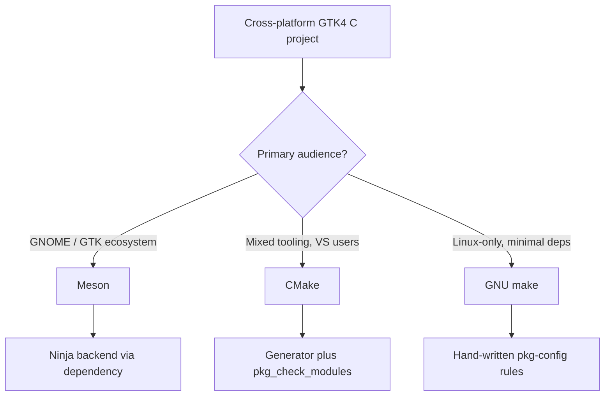

# GTK Build Systems

## Copyright

(c) Copyright 2026 onwards Warwick Molloy.
Contribution to this project is supported and contributors will be recognised.


# Context

This project will be built in C for portability and performance, targeting GTK4
as an implementation of the GTK4 Widget Gallery (see [README.md](../../README.md)).

Before adding source under `src/` and `include/`, we need to choose a build
system that supports cross-platform development and scales with many small
source files (see [c-code-standard.md](../c-code-standard.md)).

Three options were compared: Meson, CMake, and GNU make.

# Summary

| System    | Cross-platform | GTK alignment | Maintenance |
|-----------|----------------|---------------|-------------|
| Meson     | Strong         | Best          | Low         |
| CMake     | Strongest      | Good          | Low         |
| GNU make  | Linux-first    | Legacy        | High        |

Meson and CMake are both viable for a cross-platform GTK4 demo.
GNU make is acceptable only when the project scope is Linux-only (or
MSYS2-only on Windows).

# Meson

Meson is the build system used by GTK4, GLib, and most modern GNOME projects.

## Strengths

- Native fit for GTK: `dependency('gtk4')` wraps pkg-config cleanly.

- Readable build files that stay concise as the project grows.

- Cross-platform by design; generates Ninja (or other backends) rather than
  encoding platform logic in shell.

- Fast incremental builds via the Ninja backend.

- Matches upstream GNOME documentation and examples.

## Weaknesses

- Requires Meson, Ninja, and Python on contributor machines.

- Windows outside MSYS2 is possible but not the typical path.

- Smaller mindshare outside the GNOME ecosystem compared to CMake.

## Platform fit

| Platform          | Fit        |
|-------------------|------------|
| Linux             | Excellent  |
| macOS             | Excellent  |
| Windows (MSYS2)   | Very good  |
| Windows (MSVC)    | Awkward    |

## Getting started

See the [Meson Simple Start guide](https://mesonbuild.com/SimpleStart.html) for
installing Meson and Ninja on Linux, Windows, and macOS, and for creating a
first project with `meson init`.

# Ninja

Ninja is a small, fast build system that runs the actual compile and link steps.
Meson does not invoke the compiler directly; it generates Ninja build files and
Ninja executes them.

## Role in this stack

| Layer   | Responsibility                              |
|---------|---------------------------------------------|
| Meson   | Project description, dependencies, targets  |
| Ninja   | Dependency graph, incremental rebuilds      |
| Compiler| C source to object files and executables    |

Meson uses Ninja as its default backend. After setup, day-to-day builds are
typically:

1. `meson setup build` — configure once (or when build options change).

2. `meson compile -C build` — rebuild changed sources (Ninja runs underneath).

On older Meson versions the equivalent is to run `ninja` directly inside the
`build` directory.

## Strengths

- Optimised for speed: minimal overhead and fast incremental builds.

- Rebuilds only what changed, which matters as widget demo groups add many
  small files under `src/`.

- Used as a backend by Meson and optionally by CMake (`-G Ninja`), so skills
  transfer between both meta-build systems.

## Weaknesses

- Ninja build files are generated; humans edit Meson (or CMake) files, not
  `build.ninja` directly.

- Another tool to install alongside Meson (usually bundled in distro packages
  such as `ninja-build` on Debian/Ubuntu).

## Platform fit

Ninja is available on Linux, macOS, and Windows. On Windows, Meson's guide
recommends the Visual Studio developer command prompt when using the MSVC
toolchain (see the Meson Simple Start guide above).

## Installing Meson and Ninja

To ensure the tools are installed in a Debian / Ubuntu environment, run
the following commands.

The first delivers GNU C Compiler family.

The second installs meson and ninja tools.

```
sudo apt install build-essential
sudo apt install meson ninja-build
```

# CMake

CMake is the most widely used cross-platform build system for C and C++ projects.

## Strengths

- Broadest tooling support: generates Ninja, Makefiles, Visual Studio,
  and Xcode projects from one description.

- Strongest Windows and IDE integration of the three options.

- Large community, CI examples, and third-party package patterns.

- GTK4 works well via `pkg_check_modules(GTK4 REQUIRED gtk4)`.

## Weaknesses

- Not how GTK itself is built upstream (Meson holds that role).

- Syntax is more verbose and can feel indirect (CMake generates another
  build system).

- Slightly off the GNOME golden path for examples and conventions.

## Platform fit

| Platform          | Fit        |
|-------------------|------------|
| Linux             | Excellent  |
| macOS             | Excellent  |
| Windows (MSYS2)   | Very good  |
| Windows (MSVC)    | Feasible   |

# GNU make

Plain GNU make with hand-written rules is the simplest option on Linux.

## Strengths

- Minimal dependencies: a Makefile and pkg-config are enough on Linux.

- Direct control over compile and link rules.

- Easy to understand when the project is very small.

## Weaknesses

- Portability is manual: paths, shells, and pkg-config differ across platforms.

- Windows requires MSYS2, WSL, or similar; GNU make is not native.

- macOS may ship BSD make rather than GNU make (`gmake` must be documented).

- Does not scale gracefully as many small files are added under `src/<group>/`.

- Weakest IDE integration on Windows and macOS.

## Platform fit

| Platform          | Fit        |
|-------------------|------------|
| Linux             | Excellent  |
| macOS             | Good       |
| Windows (MSYS2)   | Good       |
| Windows (native)  | Poor       |

# GTK-specific factors

| Factor                     | Meson    | CMake   | GNU make |
|----------------------------|----------|---------|----------|
| Matches GTK4 upstream      | Yes      | No      | No       |
| pkg-config integration     | Built-in | modular | Manual   |
| GNOME doc examples         | Primary  | Common  | Legacy   |
| Scales with grouped `src/` | Yes      | Yes     | W effort |

All three ultimately invoke the same compiler and link against the same
GTK libraries. The choice is about orchestration and portability, not
about GTK capabilities.

# Decision guide



# Recommendation

For this project, Meson is the preferred choice.

- It aligns with how GTK4 is built and documented upstream.

- Build files stay readable as widget demo groups multiply under `src/`.

- Cross-platform support is strong on Linux, macOS, and MSYS2 on Windows.

CMake is the fallback when contributor tooling or CI must centre on Visual
Studio or an existing CMake workflow.

GNU make should be ruled out unless the project explicitly limits scope to
Linux-only development.

# Risks and concerns

1. Contributors on Windows must use MSYS2 (or similar) regardless of whether
   Meson or CMake is chosen; native MSVC workflows remain secondary for GTK.

2. ~~No build files exist in the repository yet; whichever system is chosen
   should be added before the first `src/main.c` lands.~~ **Resolved**
   (2026-07-22): root `meson.build` and `src/main.c` are in place; see
   [feature-1-base-application.md](../features/feature-1-base-application.md).

3. Meson and CMake both add meta-build dependencies that GNU make avoids;
   this trade-off is acceptable given the cross-platform goal stated in the
   README.

# Next steps

1. ~~Add a minimal `meson.build` at the repository root with `dependency('gtk4')`
   and a single executable target for `src/main.c`.~~ **Done** (Feature 1).

2. ~~Document build prerequisites and commands in the README once the first
   source files are in place.~~ **Done** (Feature 1).

3. Revisit this note if CI requirements (for example Windows MSVC) push the
   project toward CMake instead.

# Implementation

Meson was adopted as recommended. Feature 1 landed on 2026-07-22; see
[feature-1-base-application.md](../features/feature-1-base-application.md).

# References

[Meson Simple Start guide](https://mesonbuild.com/SimpleStart.html)

[Ninja build system](https://ninja-build.org/)
