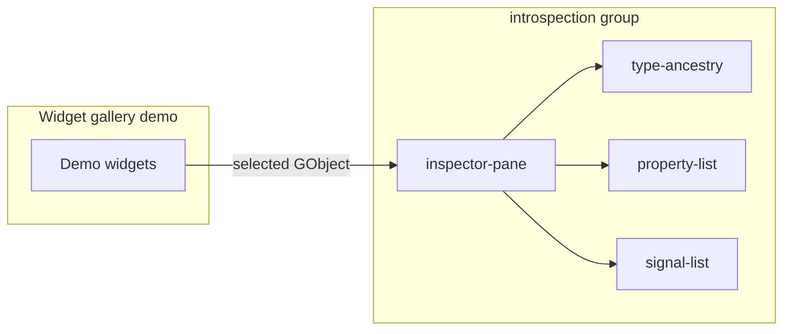

# GObject Type Exploration

## Copyright

(c) Copyright 2026 onwards Warwick Molloy.
Contribution to this project is supported and contributors will be recognised.

# Context

The GTK Widget Demo will grow from the Feature 1 shell into runnable examples
from the [GTK4 Widget Gallery](https://docs.gtk.org/gtk4/visual_index.html).
Every widget in that gallery is a [GObject](https://docs.gtk.org/gobject/class.Object.html)
subtype registered in the [GType](https://docs.gtk.org/gobject/concepts.html)
type system.

Understanding GObject types — their names, inheritance, properties, and
signals — helps when designing UI, reading GTK documentation, and debugging
layout or behaviour. This note compares ways the demo application could support
that exploration, grounded in upstream GObject documentation rather than
reinventing concepts the GNOME stack already documents well.

The base app today (`src/main.c`) creates widgets but does not expose any
type metadata. Widget gallery work is the natural place to decide how much
introspection belongs in-app versus in external tools.

# What “exploring GObject types” can mean

Three distinct goals overlap in practice but lead to different designs.

| Goal | Question answered | Typical audience |
|------|-------------------|------------------|
| Runtime inspection | What type is this widget, and what can I change on it? | App designers, debuggers |
| API literacy | How do properties, signals, and inheritance work in GTK? | Developers learning GObject |
| Custom types | How do I define my own GObject subclass or interface? | Contributors extending the demo |

The widget gallery primarily serves the first two. Custom-type tutorials are
valuable but are a separate track (see Option 4).

# GObject APIs relevant to introspection

Upstream documents the type system in
[Type System Concepts](https://docs.gtk.org/gobject/concepts.html) and
object usage in the
[GObject Tutorial](https://docs.gtk.org/gobject/tutorial.html). For
read-only exploration of existing types (such as `GtkButton`), the following
API families are the main building blocks.

## Type identity and hierarchy

| API | Purpose | Reference |
|-----|---------|-----------|
| `G_OBJECT_TYPE()` / `G_OBJECT_TYPE_NAME()` | Type id and name of an instance | [GObject.Object](https://docs.gtk.org/gobject/class.Object.html) |
| `g_type_name()` | Name from a `GType` value | [gobject index](https://docs.gtk.org/gobject/) |
| `g_type_parent()` | Direct parent in the inheritance tree | [concepts](https://docs.gtk.org/gobject/concepts.html) |
| `g_type_is_a()` | Whether a type is a descendant of another | [concepts](https://docs.gtk.org/gobject/concepts.html) |
| `g_type_query()` | Class size, instance size, type name | [g_type_query](https://docs.gtk.org/gobject/func.type_query.html), [GTypeQuery](https://docs.gtk.org/gobject/struct.TypeQuery.html) |
| `g_type_interfaces()` | Interfaces implemented by a classed type | [concepts — interfaces](https://docs.gtk.org/gobject/concepts.html) |

Walking from a widget instance up through `g_type_parent()` reproduces the
inheritance chain shown in GTK doc pages (for example `GtkButton` →
`GtkWidget` → `GInitiallyUnowned` → `GObject`).

## Properties

| API | Purpose | Reference |
|-----|---------|-----------|
| `g_object_class_list_properties()` | All `GParamSpec` entries for a class | [Object.list_properties](https://docs.gtk.org/gobject/class_method.Object.list_properties.html) |
| `g_object_get()` / `g_object_set()` | Read and write by name | [GObject.Object](https://docs.gtk.org/gobject/class.Object.html) |
| `GParamSpec` fields | Name, nick, blurb, flags, value type | [GParamSpec](https://docs.gtk.org/gobject/class.ParamSpec.html) |
| `g_strdup_value_contents()` | Debug string for a `GValue` | [gobject index](https://docs.gtk.org/gobject/) |

Property metadata is what makes generic inspectors possible: the type system
stores names and types at runtime so UI can list and edit values without
hard-coding each widget.

## Signals

| API | Purpose | Reference |
|-----|---------|-----------|
| `g_signal_list_ids()` | Signal ids defined on a type | [gobject index](https://docs.gtk.org/gobject/) |
| `g_signal_query()` | Name, parameters, flags for a signal | [GSignalQuery](https://docs.gtk.org/gobject/struct.SignalQuery.html) |
| `g_signal_connect()` | Observe emissions during exploration | [GObject signals](https://docs.gtk.org/gobject/concepts.html) |

Signal exploration is harder to present safely (handlers can have side
effects), so read-only listing is usually enough for a gallery tool.

# Options

## Option 1 — Rely on GTK Inspector (external, zero app code)

GTK ships an interactive debugger documented under
[Running and debugging GTK Applications](https://docs.gtk.org/gtk4/running.html).

Enable it with `GTK_DEBUG=interactive`, or the Control+Shift+I /
Control+Shift+D shortcuts while the app runs. The inspector shows the widget
tree, CSS, allocations, and object properties for any GTK application.

### Strengths

- No maintenance in this repository; tracks GTK releases automatically.

- Full widget-tree navigation, picking, and theme tweaking.

- Standard tool GNOME developers already use.

### Weaknesses

- Teaches GTK tooling, not necessarily how the demo code maps to types.

- Cannot show demo-specific context (which gallery example, curated notes).

- May be disabled in production builds via GSettings
  (`enable-inspector-keybinding`).

### Fit for widget demo

Essential baseline. Document inspector usage in the README or per-demo help
text regardless of other options chosen.

## Option 2 — Per-widget “Type facts” panel (curated, static)

Each gallery demo adds a small sidebar or expander with hand-written facts:
GType name, parent types, key properties used in that example, and links to
the matching [GTK4 doc page](https://docs.gtk.org/gtk4/visual_index.html).

### Strengths

- Simple to implement alongside each widget example.

- Educational content stays focused on what the demo actually uses.

- No fragile generic property editors.

### Weaknesses

- Duplicated maintenance as the gallery grows.

- Does not help when the user picks arbitrary widgets in a compound demo.

- Can drift from runtime truth if properties change between GTK versions.

## Option 3 — Shared introspection module (generic runtime browser)

Add a code group (for example `src/introspection/` with
`include/introspection.h`) that implements reusable units:

| Unit | Responsibility |
|------|----------------|
| `type-ancestry` | Walk `g_type_parent()` into a human-readable chain |
| `type-query` | Wrap `g_type_query()` and interface lists |
| `property-list` | Use `g_object_class_list_properties()` and format pspec metadata |
| `signal-list` | Use `g_signal_list_ids()` / `g_signal_query()` |
| `inspector-pane` | GTK UI: tree of ancestry, list of properties, read-only values |

The main window (or each demo page) could offer an “Inspect selection” action
that binds the pane to `gtk_widget_pick()` or the focused widget.

### Strengths

- One implementation serves all gallery demos.

- Teaches real GObject introspection APIs cited in upstream docs.

- Aligns with [c-code-standard.md](../c-code-standard.md) group/unit layout.

### Weaknesses

- Largest initial cost; property value display must handle many `GType`s
  (`gboolean`, enums, objects, etc.).

- Live `g_object_set()` from a generic UI is risky (break demos, trigger
  reentrancy); read-only display is safer for v1.

- Some properties are not meaningful out of context (object refs, internal
  state).

## Option 4 — Custom GObject tutorial demos (separate from gallery)

Implement the [GObject Tutorial](https://docs.gtk.org/gobject/tutorial.html)
`ViewerFile` example (or a minimal `DemoAnimal` type) as its own gallery
section: show `G_DEFINE_FINAL_TYPE`, properties, signals, and interface
implementation using `G_DECLARE_*` / `G_DEFINE_*` macros from the
[gobject index](https://docs.gtk.org/gobject/).

### Strengths

- Teaches type *definition*, not only introspection of GTK types.

- Directly exercises registration APIs described in
  [Type System Concepts](https://docs.gtk.org/gobject/concepts.html).

### Weaknesses

- Not required for browsing existing GTK widgets.

- More code and tests; best treated as a later feature or story, not part of
  the first widget gallery milestone.

## Option 5 — Command-line introspection alongside the GUI

Small CLI tools (or `--dump-type=GtkButton` on the existing binary) that print
JSON or plain text from the same introspection units as Option 3. Useful for
CI snapshots and docs generation.

### Strengths

- Scriptable; easy to test without driving GTK focus.

- Can verify type metadata against GTK version in CI.

### Weaknesses

- Second entry point to maintain unless folded into a `test/` harness.

- Less visible to designers using the gallery interactively.

# Comparison

| Option | Effort | Gallery integration | Teaches GObject APIs | Maintenance |
|--------|--------|---------------------|----------------------|-------------|
| 1 GTK Inspector | None in repo | Document only | Indirect | Low |
| 2 Curated panels | Low per demo | High | Medium | High (N demos) |
| 3 Introspection module | High once | High | High | Medium |
| 4 Custom types tutorial | High | Separate section | Highest (authoring) | Medium |
| 5 CLI dump | Medium | Optional | Medium | Medium |

Options 2 and 3 compose well: generic browser for any selection, plus curated
“why these properties matter” text per demo.

# Recommendation

Adopt a phased approach rather than committing to a full inspector clone
up front.

## Phase A — Baseline (immediate, no new code groups)

1. Document GTK Inspector in README: `GTK_DEBUG=interactive`, shortcuts,
   link to [GTK running/debugging](https://docs.gtk.org/gtk4/running.html).

2. When adding the first widget demos, include a short “Type” line in each
   demo (GType name + link to docs.gtk.org widget page).

## Phase B — Shared read-only introspection (first structured feature)

1. Add `introspection` group per [c-code-standard.md](../c-code-standard.md):
   `type-ancestry`, `property-list`, `signal-list`, `inspector-pane`.

2. Wire a View → Inspect widget (or toolbar toggle) in the main shell that
   shows ancestry and property metadata for the picked widget.

3. Keep values read-only in v1; use `g_strdup_value_contents()` for display.

4. Add unit tests under `test/introspection/` for ancestry and property
   listing against `GObject` and one GTK type (for example `GtkLabel`).

## Phase C — Enrichment (optional)

1. Per-demo curated notes (Option 2) in gallery content areas.

2. Signal emission log (connect temporary handlers with clear disconnect on
   pane close) for advanced demos.

3. Separate feature spec for Option 4 custom types if the project wants
   “author your own GObject” examples.

# Risks and concerns

1. **Scope creep.** A full property editor resembles GTK Inspector. Phase B
   should stop at read-only metadata unless there is a clear gallery need.

2. **GTK version drift.** Property sets differ between GTK minor releases.
   Tests should target installed GTK via pkg-config, not hard-coded lists.

3. **Object lifetime.** Picking widgets and holding `GObject*` pointers
   requires weak refs or careful disconnect when demos rebuild UI; see
   [GWeakRef](https://docs.gtk.org/gobject/struct.WeakRef.html) patterns in
   upstream docs.

4. **Signal noise.** Connecting to all signals on a widget for debugging can
   affect behaviour or performance; limit to listing in UI until explicitly
   requested.

5. **Overlap with Inspector.** In-app pane must add curated gallery context
   or teaching value, not duplicate Inspector’s tree/CSS tools.

# Open decisions

1. Should introspection live in the main window globally, or only inside each
   demo page?

2. Is live property editing in scope for any phase, or permanently out of
   scope?

3. Should Option 4 (custom GObject tutorial types) be Feature 2 or a later
   story once the widget gallery covers core controls?

# Next steps

1. Record Phase A in README when the first widget demo lands.

2. If proceeding with Phase B, write
   `docs/features/feature-2-gobject-introspection.md` with acceptance
   criteria (pick widget, show ancestry, list properties, read-only values).

3. Split stories under `docs/stories/` for `introspection` units before
   implementation.

# References

- [GObject documentation index](https://docs.gtk.org/gobject/)

- [Type System Concepts](https://docs.gtk.org/gobject/concepts.html)

- [GObject Tutorial — defining new types](https://docs.gtk.org/gobject/tutorial.html)

- [GObject.Object](https://docs.gtk.org/gobject/class.Object.html)

- [g_type_query()](https://docs.gtk.org/gobject/func.type_query.html)

- [GTypeQuery](https://docs.gtk.org/gobject/struct.TypeQuery.html)

- [Object.list_properties](https://docs.gtk.org/gobject/class_method.Object.list_properties.html)

- [GParamSpec](https://docs.gtk.org/gobject/class.ParamSpec.html)

- [GTK4 — Running and debugging (GTK Inspector)](https://docs.gtk.org/gtk4/running.html)

- [GTK4 Widget Gallery](https://docs.gtk.org/gtk4/visual_index.html)

- [Project C code standard](../c-code-standard.md)
