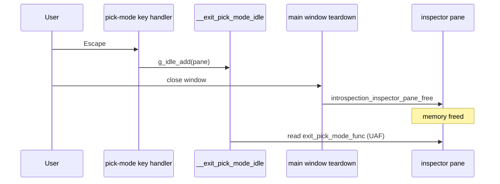

# Pick-Mode Escape Idle Use-After-Free

## Copyright

(c) Copyright 2026 onwards Warwick Molloy.
Contribution to this project is supported and contributors will be recognised.

# Context

[Feature 2](../features/feature-2-gobject-introspection.md) added View → Inspect
widget pick mode. Pressing Escape while pick mode is active should exit pick
mode and restore the default cursor, keeping the menu toggle in sync.

The escape handler lives in `src/introspection/inspector-pane/pick-mode.c`. It
defers exit through a GLib idle callback so the key-press handler can return
before the pick-mode state change runs. That deferral was introduced during
Feature 3 hardening but introduces a lifetime bug.

Related code:

- `src/introspection/inspector-pane/pick-mode.c` — key handler and idle callback
- `src/introspection/inspector-pane.c` — `introspection_inspector_pane_free`
- `src/main/window-shell.c` — registers `__exit_pick_mode` as the handler

# Problem

When the user presses Escape in pick mode, the key handler schedules
`__exit_pick_mode_idle` with a raw `IntrospectionInspectorPane *`. If the main
window is destroyed before that idle runs, `introspection_inspector_pane_free`
has already freed the pane and the idle dereferences invalid memory.

## Symptoms

- Undefined behaviour or crash on window close immediately after pressing
  Escape in pick mode.
- Most likely when pick mode is active and the user exits quickly (Escape then
  File → Exit, or closing the window while pick mode is on).

## Root cause

`g_idle_add(__exit_pick_mode_idle, pane)` does not:

1. hold a reference to the pane or its owner, or
2. cancel the source when the pane is freed.

`introspection_inspector_pane_free` clears controllers and frees `pane` but has
no hook to remove a pending idle source id.

The idle exists because the key handler must not re-enter pick-mode teardown
synchronously from inside the controller callback (the handler toggles the
`win.inspect` action, which calls back into pick-mode state updates).

# Fix options

### Option A

Store `guint exit_idle_id` on the pane; call `g_source_remove` in `free`.

Pros: minimal API change; keeps deferral.

Cons: adds one field to the private struct.

### Option B

Pass `MainWindowData *` (owner) to the idle instead of `pane`.

Pros: owner outlives the pane until window destroy.

Cons: couples the pick-mode unit to the shell ownership model.

### Option C

Call the exit handler synchronously from the key handler.

Pros: simplest code.

Cons: must verify no re-entrancy regressions in action/state sync.

### Option D

Use `g_idle_add_full` with a destroy notify that clears the id.

Pros: GLib-idiomatic lifecycle.

Cons: still needs a stored id for explicit remove on free.

# Recommended approach

## Option A

Track and cancel the idle on pane free.

### Changes

1. Add `guint exit_pick_mode_idle_id` to `IntrospectionInspectorPane` in
   `include/introspection/inspector-pane/inspector-pane-private.h` (initialise to
   `0` in `introspection_inspector_pane_new`).

2. In `__on_pick_root_key_pressed`, before scheduling:

   - if `pane->exit_pick_mode_idle_id != 0`, return `TRUE` (already pending), or
     remove the stale source first;

   - assign `pane->exit_pick_mode_idle_id = g_idle_add(...)`.

3. In `__exit_pick_mode_idle`, clear `pane->exit_pick_mode_idle_id` to `0` before
   calling the exit handler, then return `G_SOURCE_REMOVE`.

4. In `introspection_inspector_pane_free`, if `exit_pick_mode_idle_id != 0`,
   call `g_source_remove(exit_pick_mode_idle_id)`.

Option C remains a fallback if Option A still shows re-entrancy issues during
manual testing; measure that before switching.

# Acceptance criteria

1. Press Escape in pick mode — pick mode exits, cursor resets, View →
   Inspect widget unchecked.

2. Press Escape, then immediately close the window — no crash, no
   sanitizer/valgrind fault on idle dispatch.

3. Close the window while pick mode is active (without pressing Escape) — no
   regression.

4. Existing introspection unit tests pass; no new test is strictly required if
   lifecycle is covered by cancel-on-free, but a small unit test that frees the
   pane while a fake idle is pending would lock the fix in.

# Risks

| Risk                                      | Mitigation                                      |
|-------------------------------------------|-------------------------------------------------|
| Double idle if Escape is pressed rapidly  | Guard with non-zero `exit_pick_mode_idle_id`    |
| Option C re-introduces regressions        | Manual pick + inspect smoke test after rewrite  |

#### Re-entrancy during pane teardown

If the exit handler runs while the pane is mid-teardown, action/state sync may
re-enter pick-mode updates. Mitigation: remove the idle source before `free`;
only run the handler while the pane is live.

# Out of scope

Modal dialog lifecycle in gallery window demos (separate review finding in
`src/gallery/window-demos.c`) is not part of this fix.
