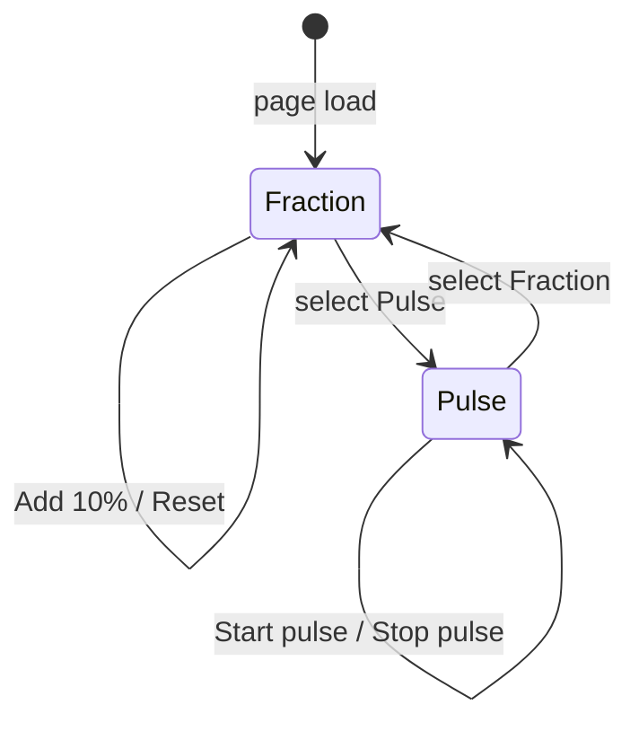

# Display Demos Pulse Mode And Spinner Button State

## Copyright

(c) Copyright 2026 onwards Warwick Molloy.
Contribution to this project is supported and contributors will be recognised.

# Context

[2026-07-31-plan-display-demos-interactive.md](./2026-07-31-plan-display-demos-interactive.md)
delivered interactive **GtkSpinner**, **GtkProgressBar**, and **GtkScale**
demos in `src/gallery/display-demos.c`. Two follow-on improvements remain:

1. **GtkProgressBar pulse mode** — the [Feature 3](../features/feature-3-widget-gallery.md)
   initial demo table describes `GtkProgressBar` as “Fraction and pulse modes”,
   but only fraction mode (Add 10% / Reset) is implemented.

2. **GtkSpinner button state** — the interactive plan noted optional polish:
   disable **Start spinner** while spinning and **Stop spinner** while idle.

Both extensions stay on the **existing demo pages** — one sidebar entry per
GType, one primary widget per page — per
[2026-07-26-plan-feature-3-one-widget-per-demo-page.md](./2026-07-26-plan-feature-3-one-widget-per-demo-page.md)
and
[2026-07-26-plan-feature-3-visual-index-source-of-truth.md](./2026-07-26-plan-feature-3-visual-index-source-of-truth.md).
A second `GtkProgressBar` catalog entry for pulse alone is out of scope.

# Decision — progress bar modes on one page

Use a **mode selector** on the existing `GtkProgressBar` demo rather than a
separate gallery entry. Fraction and pulse are behaviours of the same widget
type, not distinct visual-index types.

| Approach              | Verdict |
| --------------------- | --- |
| Second sidebar entry  | Rejected — breaks one-type-per-entry taxonomy |
| Mode selector on page | **Chosen** — one primary bar, supporting chrome switches behaviour |

# Proposed behaviour

## GtkProgressBar — fraction and pulse modes

Extend `__build_gtk_progress_bar()` with a mode control and context-sensitive
action buttons. The same `GtkProgressBar` instance remains the primary widget
throughout.

### Mode selector

| Element | Detail |
| ------- | --- |
| Control | Two `GtkToggleButton`s in one group: **Fraction** and **Pulse** |
| Default | **Fraction** selected on load (current behaviour) |
| Layout  | Mode row above the progress bar; action row below changes with mode |

When the user switches mode, tear down the previous mode cleanly (stop pulse
timer, reset fraction to `0.0`) before showing the controls for the new mode.

### Fraction mode (existing)

| Element             | Detail |
| ------------------- | --- |
| Primary widget      | `GtkProgressBar` — fraction `0.0` on entry to this mode |
| Supporting controls | **Add 10%** and **Reset** (unchanged from interactive plan) |
| Add 10%             | Add `0.1` to fraction, clamp to `1.0` |
| Reset               | `gtk_progress_bar_set_fraction(progress, 0.0)` |

### Pulse mode (new)

| Element             | Detail |
| ------------------- | --- |
| Primary widget      | Same `GtkProgressBar` — indeterminate activity via pulse |
| Supporting controls | **Start pulse** and **Stop pulse** buttons |
| Start pulse         | Start a `GTimeoutSource` (~100 ms) calling `gtk_progress_bar_pulse()` on the bar |
| Stop pulse          | `g_source_remove()` on the stored timeout id; idle bar |
| Initial state       | Not pulsing; **Start pulse** enabled, **Stop pulse** disabled |

Pulse teaches “work in progress with unknown duration” — complementary to
fraction mode’s stepped completion.

### Mode-switch lifecycle

Rules when switching:

1. **Fraction → Pulse** — ensure no active pulse timer; clear fraction display
   (set fraction to `0.0` or leave bar ready for pulse only).

2. **Pulse → Fraction** — stop and remove timeout source; reset fraction to
   `0.0`; show Add 10% / Reset row.

3. **Page destroy** — if a pulse timeout is pending, remove it (same lifetime
   pattern as pick-mode idle cancel in
   [2026-07-29-plan-pick-mode-escape-idle-uaf.md](./2026-07-29-plan-pick-mode-escape-idle-uaf.md)).

Store pulse timeout id on the demo root box or a small heap struct attached with
`g_object_set_data_full()` — no file-scope statics.

## GtkSpinner — start/stop button sensitivity (optional)

The spinner demo already calls `gtk_spinner_start()` / `gtk_spinner_stop()` from
**Start spinner** and **Stop spinner**. Optional polish mirrors real UI where
only valid actions are enabled.

| Element             | Detail |
| ------------------- | --- |
| Primary widget      | `GtkSpinner` — idle on load (unchanged) |
| Initial sensitivity | **Start spinner** enabled; **Stop spinner** disabled |
| After Start         | **Start spinner** disabled; **Stop spinner** enabled |
| After Stop          | **Start spinner** enabled; **Stop spinner** disabled |
| API                 | `gtk_widget_set_sensitive()` on each button after start/stop |

Implementation: pass a small struct (spinner + both buttons) to click handlers,
or update sensitivity in each handler via `g_object_get_data()`.

This extension is **optional** — the demo is already functional without it.
Implement together with pulse mode if touching `display-demos.c` anyway, or
defer without blocking pulse delivery.

# Implementation sketch

All changes in `src/gallery/display-demos.c` unless the file grows enough to
split per [c-code-standard.md](../c-code-standard.md).

## Shared patterns

1. Reuse vertical `GtkBox` roots and `hexpand = FALSE` on compact buttons per
   [2026-07-30-plan-widget-align-natural-size.md](./2026-07-30-plan-widget-align-natural-size.md).

2. Use `gtk_toggle_button_set_group()` (or equivalent) so **Fraction** and
   **Pulse** are mutually exclusive.

3. Show/hide or reparent action button rows when mode changes, or keep both rows
   in the box and toggle `gtk_widget_set_visible()` — avoid duplicate signal
   handlers on hidden buttons.

4. Update the `GtkProgressBar` demo **description** string in `display_demos[]`
   to mention fraction and pulse modes.

5. Optionally update the `GtkSpinner` description if button sensitivity is
   shipped (for example “buttons enable and disable with spinner state”).

## Suggested pulse timeout interval

100 ms is a common default for `gtk_progress_bar_pulse()` timers and matches
GTK examples. Not user-configurable in this demo.

# Acceptance criteria

## Required — progress bar pulse mode

1. **GtkProgressBar** demo offers **Fraction** and **Pulse** mode selection on
   one page; **Fraction** is default.

2. **Fraction** mode retains Add 10% / Reset behaviour from the interactive plan.

3. **Pulse** mode: **Start pulse** runs periodic `gtk_progress_bar_pulse()`;
   **Stop pulse** stops the timer; no timeout fires after stop or mode switch.

4. Switching modes resets state cleanly; no leaked `GTimeoutSource` when leaving
   the demo page.

5. One sidebar entry remains **GtkProgressBar**; pick mode targets the bar.

6. `meson test -C build` passes.

## Optional — spinner button sensitivity

7. **GtkSpinner** demo: **Stop spinner** disabled while idle; **Start spinner**
   disabled while spinning.

8. Sensitivity updates on every start/stop click; initial state correct on load.

# Risks

| Risk                        | Mitigation |
| --------------------------- | --- |
| Pulse timer after page gone | Store source id; remove in mode switch and on widget destroy |
| Mode switch mid-pulse       | Stop timer before changing visible controls |
| Cluttered demo layout       | Mode row + one action row; hide inactive row |
| Pick mode vs mode toggles   | Same as other display demos; primary widget remains the bar/spinner |
| Optional scope creep        | Mark spinner sensitivity optional; ship pulse mode independently |

# Out of scope

1. A second gallery entry for pulse-only progress bar.

2. User-configurable pulse interval or fraction step size.

3. Showing fraction and pulse bars side by side (multi-instance layout).

4. Automated UI tests for timers or mode switching.

5. Changes to `demo-page.c`, registry counts, or gallery shell navigation.

# References

[feature-3-widget-gallery.md](../features/feature-3-widget-gallery.md)

[2026-07-31-plan-display-demos-interactive.md](./2026-07-31-plan-display-demos-interactive.md)

[2026-07-26-plan-feature-3-one-widget-per-demo-page.md](./2026-07-26-plan-feature-3-one-widget-per-demo-page.md)

[2026-07-26-plan-feature-3-visual-index-source-of-truth.md](./2026-07-26-plan-feature-3-visual-index-source-of-truth.md)

[2026-07-30-plan-widget-align-natural-size.md](./2026-07-30-plan-widget-align-natural-size.md)

[src/gallery/display-demos.c](../../src/gallery/display-demos.c)

[GtkProgressBar](https://docs.gtk.org/gtk4/class.ProgressBar.html)

[GtkSpinner](https://docs.gtk.org/gtk4/class.Spinner.html)
