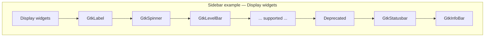

# Gallery Deprecated Widget Separation

## Copyright

(c) Copyright 2026 onwards Warwick Molloy.
Contribution to this project is supported and contributors will be recognised.

# Context

The gallery follows the upstream
[GTK4 visual index](https://docs.gtk.org/gtk4/visual_index.html) for category
names, demo titles, and ordering — see
[2026-07-26-plan-feature-3-visual-index-source-of-truth.md](./2026-07-26-plan-feature-3-visual-index-source-of-truth.md).
That index still lists widgets whose C APIs are marked **deprecated** in current
GTK 4 releases (headers under `gtk/deprecated/`).

Feature 4 already ships demos that compile with deprecation warnings, including
**GtkStatusbar** and **GtkInfoBar**. Upcoming catalog waves from
[2026-08-05-plan-widget-gallery-catalog-nine-waves.md](./2026-08-05-plan-widget-gallery-catalog-nine-waves.md)
will add many more deprecated types (**GtkMessageDialog**, **GtkComboBox**,
**GtkTreeView**, **GtkFileChooserDialog**, and others).

Developers using this app to choose widgets for new work need to see at a glance
which examples represent **long-term GTK 4 APIs** and which are **legacy /
scheduled for removal**. This note plans how to organise the gallery without
abandoning the visual index as the naming and linking authority.

# Problem

| Tension | Detail |
| ------- | --- |
| Visual index vs GTK lifecycle | Upstream grouping keeps deprecated widgets beside modern ones |
| Teaching value | Legacy widgets remain useful for maintaining existing apps |
| New-app guidance | Without separation, the gallery implicitly recommends deprecated APIs |
| Compile hygiene | Deprecation warnings spread across demo sources |
| Catalog waves | Nine-wave plan will grow deprecated surface area unless classified early |

# Goals

1. Make **supported vs deprecated** status visible in the gallery UI.

2. Keep **visual-index category names and GType titles** unchanged.

3. Preserve **one demo per visual-index widget** for catalog completeness.

4. Point users to **documented replacements** where GTK defines them.

5. Keep registry and shell changes **incremental** — metadata first, navigation
   second, optional filters later.

# Non-goals

1. Removing deprecated widgets from the catalog (unless GTK drops them from the
   visual index).

2. Replacing the five visual-index sections with a wholly custom taxonomy.

3. Automated UI tests for every deprecated demo (manual verification remains
   enough per existing feature acceptance patterns).

# Decision

**Add lifecycle metadata to the demo registry and partition the sidebar within
each visual-index category** into supported demos first, then a **Deprecated**
subsection for demos whose primary widget type is deprecated in the project's
target GTK version.

Demo pages for deprecated entries show a standard notice in shared page chrome
(replacement link when known). Visual-index order is preserved **within each
subsection** (supported block, then deprecated block).

# Rationale

## Why not a sixth top-level category?

A single **Deprecated widgets** section would break visual-index alignment and
scatter context (for example **GtkTreeView** is a Containers widget, not a
separate domain). Developers browsing **Containers** would miss that half the
category is legacy.

## Why not badges only?

A sidebar suffix such as “(deprecated)” on every row is easy to miss and clutters
GType names. A subsection header makes the split scannable while keeping titles
clean.

## Why keep deprecated demos at all?

The project's audience includes maintainers of existing GTK 3/4 apps. Runnable
deprecated examples plus introspection remain valuable until upstream removes the
type. Separation clarifies intent: **teach migration, do not recommend for new
UI**.

# Lifecycle model

## Registry enum

Extend `GalleryDemoEntry` with a lifecycle field:

| Value | Meaning | Sidebar |
| ----- | ------- | --- |
| `GALLERY_DEMO_SUPPORTED` | Primary type not deprecated in target GTK | Main category list |
| `GALLERY_DEMO_DEPRECATED` | Primary type deprecated in target GTK | **Deprecated** subsection under same category |

Optional later value `GALLERY_DEMO_REMOVED` is out of scope until GTK actually
drops a visual-index entry.

Optional fields (same struct or parallel table):

- `replacement_doc_url` — link to successor API (for example GtkAlertDialog for
  GtkMessageDialog).

- `deprecation_note` — one short sentence for the demo page banner (overrides
  generic text when set).

Default for existing entries: **`SUPPORTED`** until classified.

## Classification source of truth

Maintain a curated list in the repo, updated when `include/gtk-version.h` target
changes:

1. **Primary:** GTK headers — type listed under `gtk/deprecated/` or API marked
   `GDK_DEPRECATED` for the widget constructor used in the demo.

2. **Secondary:** [docs.gtk.org](https://docs.gtk.org/gtk4/) class pages
   (Deprecated badge).

3. **Manual override:** planning note or YAML/CSV table committed under
   `docs/` when docs and headers disagree.

Do **not** infer deprecation from compiler warnings alone at build time — CI
would vary by distro GTK patch level. Classification is **explicit per demo** in
registry tables.

## Known classification (GTK 4.22 baseline)

### Already in gallery (25 demos)

| Demo | Lifecycle | Notes |
| ---- | --------- | --- |
| GtkStatusbar | Deprecated | `gtk/deprecated/gtkstatusbar.h` |
| GtkInfoBar | Deprecated | `gtk/deprecated/gtkinfobar.h` |
| GtkMessageDialog | Deprecated | `gtk/deprecated/gtkmessagedialog.h` |
| GtkAboutDialog | Supported | Not in deprecated headers |
| All other shipped demos | Supported | — |

### Planned catalog (selected deprecated entries)

| Demo | Lifecycle | Typical replacement direction |
| ---- | --------- | --- |
| GtkComboBox, GtkComboBoxText | Deprecated | GtkDropDown, GtkStringList |
| GtkLockButton, GtkVolumeButton | Deprecated | Custom controls / different patterns |
| GtkAppChooserButton | Deprecated | Portal or manual app list |
| GtkTreeView, GtkIconView | Deprecated | GtkListView, GtkColumnView, GtkGridView |
| GtkDialog | Deprecated | GtkWindow, response handling |
| GtkAssistant | Deprecated | GtkStack, custom stepped UI |
| GtkColorChooserDialog | Deprecated | GtkColorDialog |
| GtkFileChooserDialog | Deprecated | GtkFileDialog |
| GtkFontChooserDialog | Deprecated | GtkFontDialog |
| GtkAppChooserDialog | Deprecated | Platform-specific chooser |
| GtkShortcutsWindow | Deprecated | GtkShortcutController, custom help |

Modern dialog-button types in later waves (**GtkColorDialogButton**,
**GtkFontDialogButton**) remain **Supported**.

# Application UI

## Sidebar (gallery-shell)

Within each visual-index category, emit rows in this order:

1. Category header (unchanged) — e.g. **Display widgets**.

2. Supported demos in visual-index order.

3. If the category has any deprecated demos: unselectable subheader row
   **Deprecated** (CSS class `heading`, extra indent or muted style).

4. Deprecated demos in visual-index order.

Default startup selection stays the first **supported** demo in the first
category (**GtkLabel**), not the first deprecated entry.

## Demo page chrome (demo-page)

When `lifecycle == DEPRECATED`:

1. Insert a notice below the description: **“Deprecated in GTK 4 — avoid for new
   designs.”**

2. If `replacement_doc_url` is set, add **“See replacement API”** link (same
   pattern as upstream doc link).

3. Do not change the primary widget demo content — the page still runs the
   legacy API intentionally.

## View menu (phase 2, optional)

**View → Hide deprecated demos** toggle (radio with **Show all**). Hidden mode
skips deprecated subsection headers and rows; registry and tests still register
all entries. Defer until subsection UX is stable.

# Code layout

| Area | Change |
| ---- | --- |
| `include/gallery/demo-registry.h` | `GalleryDemoLifecycle` enum; extend `GalleryDemoEntry` |
| Category registry tables | Set lifecycle per entry; add replacement URLs where known |
| `src/gallery/gallery-shell.c` | Two-pass or tagged iteration when building sidebar |
| `src/gallery/demo-page.c` | Deprecation banner from entry metadata |
| `docs/notes/` | Curated deprecation table (this note + updates on GTK bump) |
| `test/gallery/demo-registry.c` | Assert known deprecated ids; subsection counts |
| `test/gallery/gallery-shell.c` | Deprecated subheader present when expected; default selection |

Deprecated demo sources may wrap includes with `#pragma GCC diagnostic ignored
"-Wdeprecated-declarations"` **only in those sub-units**, keeping warning_level=3
elsewhere — optional hygiene, not required for phase 1.

# Phasing

## Phase 1 — Metadata and UI separation (recommended next feature)

1. Add lifecycle fields to registry struct and classify all **25** current demos.

2. Update gallery-shell sidebar subsections.

3. Add demo-page deprecation banner.

4. Extend registry and gallery-shell tests.

5. Document classification rules in this note.

**Acceptance:** Sidebar shows **Deprecated** under Display (Statusbar, InfoBar)
and Windows (MessageDialog); demo pages show banner; tests pass.

## Phase 2 — Curated replacement links

Fill `replacement_doc_url` for deprecated demos with clear GTK 4 successors.
Expand classification table as new waves land.

## Phase 3 — Optional hide toggle and introspection hint

View menu filter; optional inspector pane badge when picked widget type is
deprecated (read lifecycle from registry by demo context, not global type map).

# Impact on catalog waves

Nine-wave delivery continues — deprecated widgets are **not** dropped from waves.
When registering a new demo:

1. Set lifecycle from classification table.

2. Place in correct sidebar subsection automatically from lifecycle.

3. Add replacement link before or in the same PR when GTK documents a successor.

Wave 5 (combo boxes) and waves 7–9 (tree views, classic dialogs) will populate
deprecated subsections heavily; that is expected and desirable.

# Alternatives considered

## Drop deprecated widgets from the gallery

**Rejected:** contradicts visual-index completeness goal; hurts maintainers of
legacy codebases.

## Separate executable or mode “Legacy gallery”

**Rejected:** duplicates registry and navigation; higher maintenance than
subsection metadata.

## Infer deprecation dynamically via `GObject` metadata

**Rejected:** unreliable across GTK versions; no replacement URL; harder to
test deterministically.

# Risks

| Risk | Mitigation |
| ---- | ---------- |
| Visual-index order vs subsection split | Order within supported and within deprecated blocks separately; document rule |
| GTK reclassifies APIs | Version the table; review on `gtk-version.h` bumps |
| Subsection headers confuse tests | Update `gallery-shell` tests to count headers and deprecated rows explicitly |
| Long deprecated lists in Containers/Windows | Phase 3 hide toggle; subheaders keep scanability |
| Replacement links go stale | Link to docs.gtk.org class pages; review in coding notes |

# Open decisions

1. **Subheader label** — proposed **Deprecated**; alternatives: **Legacy APIs**,
   **Scheduled for removal**.

2. **Replacement links required?** — proposed optional in phase 1, required for
   new deprecated demos from phase 2 onward.

3. **Pragma isolation for deprecated demo .c files** — proposed yes when warnings
   exceed noise threshold; decide during phase 1 implementation.

# References

[2026-07-26-plan-feature-3-visual-index-source-of-truth.md](./2026-07-26-plan-feature-3-visual-index-source-of-truth.md)

[2026-08-05-plan-widget-gallery-catalog-nine-waves.md](./2026-08-05-plan-widget-gallery-catalog-nine-waves.md)

[feature-4-widget-gallery-catalog-wave-1.md](../features/feature-4-widget-gallery-catalog-wave-1.md)

[GTK4 Widget Gallery — visual index](https://docs.gtk.org/gtk4/visual_index.html)

[GtkAlertDialog](https://docs.gtk.org/gtk4/class.AlertDialog.html) (successor pattern for message dialogs)

[doc-guide.md](../doc-guide.md)
