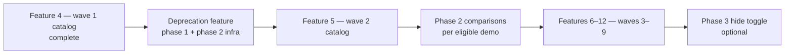

# Deprecated Widget Support Delivery Order

## Copyright

(c) Copyright 2026 onwards Warwick Molloy.
Contribution to this project is supported and contributors will be recognised.

# Context

[2026-08-05-plan-gallery-deprecated-widget-separation.md](./2026-08-05-plan-gallery-deprecated-widget-separation.md)
defines three phases of deprecated-widget support for the gallery: lifecycle
metadata and sidebar subsections (phase 1), replacement links and optional
migration comparison (phase 2), and an optional hide toggle (phase 3).

[Feature 4](../features/feature-4-widget-gallery-catalog-wave-1.md) (catalog
wave 1) is **complete** and already ships deprecated demos (**GtkStatusbar**,
**GtkInfoBar**, **GtkMessageDialog**) among **25** total entries. The nine-wave
catalog plan in
[2026-08-05-plan-widget-gallery-catalog-nine-waves.md](./2026-08-05-plan-widget-gallery-catalog-nine-waves.md)
continues with wave 2 (Feature 5) and beyond.

This note resolves **when** each deprecation phase should land relative to catalog
waves — without redefining the technical design in the separation note.

# Problem

Two delivery strategies were considered:

1. **Phase 1 first, phase 2 bundled into Feature 4** — ship deprecation UI with
   the wave 1 catalog milestone.

2. **All three deprecation phases before Feature 4** — complete deprecation
   infrastructure before any further catalog expansion.

Neither matches how the catalog and deprecation concerns intersect: Feature 4 is
already complete as a demo-only expansion; phase 2 comparison content targets
widgets that arrive in **later** waves; phase 3 is explicitly optional and only
valuable once deprecated lists grow.

# Decision

**Deliver deprecation as a horizontal gallery feature, not as part of catalog
wave milestones.**

1. **Phase 1 plus phase 2 infrastructure** — one dedicated feature, landing
   **before or immediately after** catalog wave 1 merges, and **before** wave 2
   (Feature 5) begins.

2. **Phase 2 comparison content** — incremental: add `build_comparison` builders
   in the same PR (or immediate follow-up) as each **comparison-eligible**
   deprecated demo registers in a catalog wave.

3. **Phase 3** — defer until deprecated subsections become long (roughly catalog
   waves 7–9), not before wave 2.

4. **Catalog waves continue on schedule** — classify lifecycle on every new demo;
   do not block waves waiting for comparison builders or the hide toggle.

# Recommended timeline

| Step | Feature / wave                  | Deprecation work                                                            | Rationale |
| ---- | ------------------------------- | --------------------------------------------------------------------------- | --- |
| 1    | Feature 4 (wave 1)              | **None required** — catalog only                                            | Already complete; specced without shell changes |
| 2    | Deprecation feature             | Phase 1 + phase 2 **infrastructure**                                        | Immediate value for Statusbar, InfoBar, MessageDialog |
| 3    | Feature 5 (wave 2)              | Classify new demos only                                                     | GL / video / popover spike stays focused |
| 4    | Features 6–8 (waves 3–5)        | `replacement_doc_url` on new deprecated entries; first comparison at wave 5 | GtkComboBox → GtkDropDown is first eligible pair |
| 5    | Features 9–12 (waves 6–9)       | Comparisons for eligible dialog demos; expand classification table          | Chooser dialogs batch in wave 9 |
| 6    | After wave 7 or when lists grow | Phase 3 hide toggle                                                         | Optional; subsections still scannable before then |

# Phase breakdown

## Deprecation feature (phase 1 + phase 2 infrastructure)

Ship as **one reviewable feature** separate from catalog wave PRs. Scope matches
[Phasing — phase 1 and phase 2](./2026-08-05-plan-gallery-deprecated-widget-separation.md#phasing)
in the separation note, with phase 2 limited to **API and page chrome**, not
comparison builders:

1. `GalleryDemoLifecycle` enum and fields on `GalleryDemoEntry`.

2. Classify all **25** current demos.

3. Sidebar **Deprecated** subsections in `gallery-shell.c`.

4. Deprecation banner and **See replacement API** link in `demo-page.c`.

5. `gallery_demo_page_new(entry, legacy_content, comparison_content)` API.

6. `build_comparison`, `comparison_title`, and `comparison_doc_url` hooks wired in
   shell and demo page — callbacks remain `NULL` until eligible demos land.

7. Registry and gallery-shell tests for lifecycle, subheaders, and banner.

**Acceptance:** Sidebar shows **Deprecated** under Display (Statusbar, InfoBar)
and Windows (MessageDialog); deprecated pages show banner; MessageDialog has
`replacement_doc_url`; tests pass; no comparison sections yet.

## Phase 2 comparison content (incremental, per catalog wave)

Add comparison builders **only** when a deprecated demo registers and appears in
the [comparison eligibility table](./2026-08-05-plan-gallery-deprecated-widget-separation.md#comparison-eligibility-gtk-422-baseline):

| Catalog wave | Feature (expected) | First comparison candidates |
| ------------ | ------------------ | --- |
| 1            | Feature 4          | None — Statusbar and InfoBar ineligible; MessageDialog eligible but deferred |
| 5            | Feature 8          | **GtkComboBox** / **GtkComboBoxText** → GtkDropDown |
| 9            | Feature 12         | GtkColorChooserDialog, GtkFileChooserDialog, GtkFontChooserDialog, GtkMessageDialog (if not done earlier) |

Demos without a 1:1 successor remain **banner + replacement link only** —
`build_comparison` stays `NULL`.

**Acceptance per comparison:** deprecated demo page shows **Modern alternative**
frame; legacy block remains primary inspect target; supported successor keeps its
own sidebar entry.

## Phase 3 (deferred)

**View → Hide deprecated demos** toggle and optional introspection badge — ship
when Containers or Windows deprecated subsections make scanning difficult
(anticipated waves 7–9). Not a prerequisite for wave 2 or for comparison
delivery.

# Per-wave checklist for catalog contributors

When registering a demo in any catalog wave:

1. Set `lifecycle` from the classification table in the separation note.

2. Sidebar placement follows lifecycle automatically — no shell edits.

3. Add `replacement_doc_url` when GTK documents a successor (required for new
   deprecated demos from phase 2 onward).

4. Add `build_comparison` in the same PR or immediate follow-up **only** when the
   demo is comparison-eligible.

5. Update registry smoke tests and classification tables in `docs/notes/`.

# Alternatives considered

## Phase 1 now, phase 2 inside Feature 4

**Rejected.** Feature 4 is complete and catalog-only. Wave 1 deprecated widgets
(Statusbar, InfoBar) are not comparison-eligible. Mixing deprecation
infrastructure into a closed catalog milestone increases review scope without
delivering comparison value.

## All three phases before Feature 4

**Rejected.** Would have delayed wave 1 demos that are already shipped. Phase 3
adds menu complexity before deprecated lists are long enough to need it. Phase 2
comparison targets widgets that do not exist in the catalog until waves 5 and 9.

## One mega-feature: deprecation plus wave 2

**Rejected.** Catalog wave 2 is a deliberate GL / video / popover risk spike;
combining it with gallery-shell and demo-page refactors obscures failure
diagnosis and review.

# Relationship to feature numbering

Catalog features **5–12** map to waves **2–9** per the nine-waves note.
Deprecation phase 1 + infrastructure is a **cross-cutting gallery feature** —
spec it as its own feature document (for example **Feature 5 — deprecated widget
separation** with catalog wave 2 renumbered to Feature 6, or deliver deprecation
on a focused branch merged before Feature 5 wave 2 work begins). The important
constraint is **merge order**, not whether deprecation consumes a feature number.

Recommended merge order:

1. Feature 4 (done).

2. Deprecation feature (phase 1 + phase 2 infra).

3. Feature 5 / wave 2 and subsequent catalog waves.

# Current branch state

Work on branch `wm/deprecated` aligns with step 2 above: lifecycle metadata,
deprecated subheaders, deprecation banner, comparison API hooks, and
`replacement_doc_url` on GtkMessageDialog appear implemented; no
`build_comparison` builders are wired; phase 3 is not started.

# Closed decisions

1. **Do not block catalog waves** on deprecation phases beyond classifying each
   new demo.

2. **Phase 1 + phase 2 infrastructure** ship as one dedicated feature before wave
   2 catalog work.

3. **Phase 2 comparison builders** ship incrementally with eligible demos in
   waves 5 and 9 (MessageDialog comparison optional earlier).

4. **Phase 3** deferred until deprecated subsections grow — not before wave 2.

# References

[2026-08-05-plan-gallery-deprecated-widget-separation.md](./2026-08-05-plan-gallery-deprecated-widget-separation.md)

[2026-08-05-plan-widget-gallery-catalog-nine-waves.md](./2026-08-05-plan-widget-gallery-catalog-nine-waves.md)

[feature-4-widget-gallery-catalog-wave-1.md](../features/feature-4-widget-gallery-catalog-wave-1.md)

[2026-07-26-plan-feature-3-framework-first-catalog-later.md](./2026-07-26-plan-feature-3-framework-first-catalog-later.md)

[doc-guide.md](../doc-guide.md)
